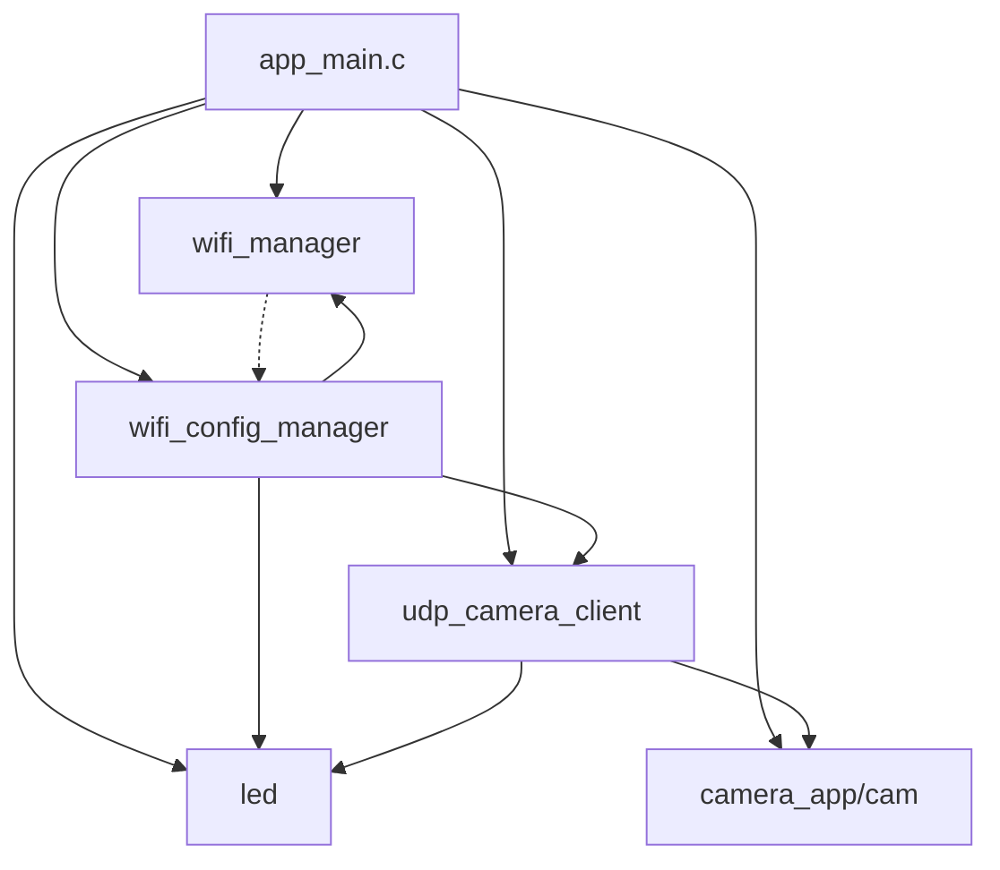

# ESP32-CAM WiFi项目模块化分析报告

## 项目概述
这是一个基于ESP32-CAM的WiFi摄像头项目，支持SoftAP/STA双模式、Web配置门户、UDP图像传输等功能。

## 当前模块结构

### 现有模块列表

| 模块 | 文件 | 职责 |
|------|------|------|
| 主程序 | `app_main.c` | 程序入口、模块初始化协调 |
| WiFi管理 | `wifi_manager.h/c` | WiFi硬件初始化、AP/STA模式设置 |
| WiFi配置 | `wifi_config_manager.h/c` | Web配置门户、NVS存储、按钮检测 |
| LED控制 | `led.h/c` | LED状态指示（常亮、闪烁、呼吸） |
| UDP传输 | `udp_camera_client.h/c` | UDP图像传输、帧率统计 |
| 摄像头 | `camera_app.h` + `cam.c` | 摄像头初始化和捕获 |

### 模块依赖关系图



---

## 模块化设计评估

### 优点

1. **清晰的文件组织**
   - 每个模块有独立的头文件和实现文件
   - 头文件提供了良好的API文档注释

2. **功能职责基本分离**
   - WiFi硬件管理与配置管理分离
   - LED控制独立封装
   - UDP传输逻辑独立

3. **良好的错误处理**
   - 大部分函数返回 `esp_err_t`
   - 使用 `ESP_ERROR_CHECK` 进行错误检查

4. **合理的资源管理**
   - LED模块使用独立任务管理状态
   - UDP模块实现了socket复用

---

## 存在的问题

### 1. 命名不一致

**问题：**
- 头文件 `camera_app.h` 与实现文件 `cam.c` 不匹配
- 应统一为 `camera.h/c` 或 `camera_app.h/c`

**影响：**
- 降低代码可读性
- 容易造成混淆

---

### 2. 模块职责过重（SRP违反）

**问题模块：** `wifi_config_manager.c`

**当前职责：**
- GPIO中断处理
- Web服务器（HTTP处理）
- WiFi扫描
- NVS存储管理
- mDNS服务
- NetBIOS服务
- WiFi连接逻辑

**违反原则：** 单一职责原则（SRP）

**影响：**
- 代码行数过多（881行）
- 难以测试和维护
- 修改一个功能可能影响其他功能

---

### 3. 硬编码配置

**问题位置：** `udp_camera_client.c`

```c
#define UDP_SERVER_IP "192.168.5.3"
#define UDP_SERVER_PORT 8080
```

**问题：**
- 目标IP和端口硬编码
- 无法动态配置
- 部署到不同环境需要修改代码

---

### 4. HTML/CSS/JavaScript硬编码

**问题位置：** `wifi_config_manager.c` 第111-228行

**问题：**
- Web页面HTML硬编码在C文件中
- CSS样式混在HTML中
- JavaScript逻辑内嵌
- 难以维护和美化界面

---

### 5. 循环依赖风险

**问题：**
- `wifi_config_manager.c` 依赖 `wifi_manager.h`
- 但 `wifi_config_manager.c` 直接调用 `esp_wifi_set_config()`，绕过了 `wifi_manager`

**影响：**
- 破坏了封装性
- WiFi状态管理不一致

---

### 6. 缺少抽象层

**问题：**
- NVS操作分散在 `wifi_config_manager.c` 中
- 没有统一的配置管理抽象
- 其他模块需要NVS时需要重复实现

---

### 7. 状态管理分散

**问题：**
- WiFi连接状态在 `wifi_manager.c` 中管理
- 配置模式状态在 `wifi_config_manager.c` 中管理
- LED状态在 `led.c` 中管理
- UDP任务状态在 `udp_camera_client.c` 中管理

**影响：**
- 状态转换逻辑分散
- 难以追踪系统整体状态

---

### 8. 错误处理不一致

**问题：**
- 某些函数使用 `ESP_ERROR_CHECK`（会终止程序）
- 某些函数返回 `esp_err_t`（允许调用者处理）
- 某些函数使用 `ESP_ERROR_CHECK_WITHOUT_ABORT`

**影响：**
- 错误处理策略不统一
- 难以确定错误的严重程度

---

### 9. 资源生命周期管理不清晰

**问题：**
- Socket初始化在 `udp_camera_client.c` 中
- 某些资源没有明确的清理时机
- 任务删除逻辑分散

---

### 10. 缺少日志级别管理

**问题：**
- 所有日志使用 `ESP_LOGI` 或 `ESP_LOGE`
- 没有使用 `ESP_LOGD`/`ESP_LOGV` 进行调试
- 生产环境日志过多

---

## 优化建议

### 1. 重命名文件

**操作：**
- 将 `cam.c` 重命名为 `camera.c`
- 或将 `camera_app.h` 重命名为 `cam.h`

**优先级：** 低

---

### 2. 拆分 wifi_config_manager 模块

**建议新模块结构：**

```
wifi_config_manager/          # 配置管理模块
├── wifi_config_manager.h     # 配置管理接口
├── wifi_config_manager.c     # 配置管理实现
├── nvs_storage.h             # NVS存储抽象
├── nvs_storage.c             # NVS存储实现
└── wifi_credentials.h        # 凭据定义

web_server/                   # Web服务器模块
├── web_server.h              # Web服务器接口
├── web_server.c              # Web服务器实现
├── handlers/                 # HTTP请求处理器
│   ├── index_handler.c
│   ├── scan_handler.c
│   └── save_handler.c
└── html/                     # Web资源
    ├── index.html
    ├── style.css
    └── app.js

button_monitor/               # 按钮监控模块
├── button_monitor.h
└── button_monitor.c
```

**优先级：** 高

---

### 3. 创建配置管理模块

**建议结构：**

```c
// config_manager.h
typedef enum {
    CONFIG_KEY_UDP_IP,
    CONFIG_KEY_UDP_PORT,
    CONFIG_KEY_WIFI_SSID,
    CONFIG_KEY_WIFI_PASSWORD,
    // ...
} config_key_t;

esp_err_t config_set_string(config_key_t key, const char* value);
esp_err_t config_get_string(config_key_t key, char* buf, size_t len);
esp_err_t config_set_int(config_key_t key, int value);
esp_err_t config_get_int(config_key_t key, int* value);
```

**优先级：** 高

---

### 4. 将Web资源移至独立文件

**建议：**
- 创建 `main/html/` 目录
- 将HTML、CSS、JavaScript分离到独立文件
- 使用文件系统（SPIFFS/SD卡）或编译时嵌入

**优先级：** 中

---

### 5. 统一错误处理策略

**建议：**
- 定义错误处理宏
- 区分致命错误和可恢复错误
- 提供错误回调机制

```c
// error_handler.h
typedef void (*error_callback_t)(esp_err_t err, const char* context);

void error_handler_register_callback(error_callback_t callback);
void error_handler_report(esp_err_t err, const char* context, bool fatal);
```

**优先级：** 中

---

### 6. 创建状态机模块

**建议结构：**

```c
// system_state.h
typedef enum {
    STATE_BOOTING,
    STATE_WIFI_DISCONNECTED,
    STATE_WIFI_CONNECTING,
    STATE_WIFI_CONNECTED,
    STATE_PROVISIONING,
    STATE_CAMERA_ACTIVE,
    STATE_ERROR,
} system_state_t;

typedef void (*state_change_callback_t)(system_state_t old_state, system_state_t new_state);

void state_machine_init(void);
system_state_t state_machine_get_state(void);
esp_err_t state_machine_transition_to(system_state_t new_state);
void state_machine_register_callback(state_change_callback_t callback);
```

**优先级：** 高

---

### 7. 改进日志管理

**建议：**
- 使用Kconfig配置日志级别
- 为不同模块定义不同的TAG
- 使用 `ESP_LOGD`/`ESP_LOGV` 进行调试日志

```c
// 在Kconfig中添加
config LOG_LEVEL_WIFI
    int "WiFi log level"
    default 2

config LOG_LEVEL_CAMERA
    int "Camera log level"
    default 2
```

**优先级：** 低

---

### 8. 添加单元测试支持

**建议：**
- 使用依赖注入
- 为关键模块添加测试接口
- 创建测试框架

**优先级：** 中

---

### 9. 改进资源管理

**建议：**
- 创建资源管理器
- 使用RAII模式（C语言中通过函数指针实现）
- 统一资源生命周期

```c
// resource_manager.h
typedef struct {
    void* (*init)(void);
    void (*cleanup)(void* resource);
    const char* name;
} resource_ops_t;

esp_err_t resource_manager_register(const char* name, resource_ops_t* ops);
void* resource_manager_get(const char* name);
esp_err_t resource_manager_cleanup_all(void);
```

**优先级：** 中

---

### 10. 改进模块接口设计

**建议：**
- 使用结构体封装模块状态
- 提供完整的生命周期接口（init/deinit）
- 减少全局变量

```c
// 示例：改进后的LED模块接口
typedef struct led_module_t led_module_t;

led_module_t* led_module_create(int gpio_num, bool active_low);
esp_err_t led_module_destroy(led_module_t* module);
esp_err_t led_module_set_state(led_module_t* module, led_state_t state);
```

**优先级：** 高

---

## 重构优先级

| 优先级 | 优化项 | 工作量 | 收益 |
|--------|--------|--------|------|
| 高 | 拆分wifi_config_manager | 大 | 大 |
| 高 | 创建状态机模块 | 中 | 大 |
| 高 | 改进模块接口设计 | 中 | 大 |
| 高 | 创建配置管理模块 | 中 | 中 |
| 中 | 将Web资源移至独立文件 | 中 | 中 |
| 中 | 统一错误处理策略 | 小 | 中 |
| 中 | 添加单元测试支持 | 中 | 中 |
| 中 | 改进资源管理 | 中 | 中 |
| 低 | 重命名文件 | 小 | 小 |
| 低 | 改进日志管理 | 小 | 小 |

---

## 建议的重构步骤

1. **第一阶段：基础重构**
   - 重命名文件
   - 改进日志管理

2. **第二阶段：模块拆分**
   - 创建配置管理模块
   - 拆分wifi_config_manager
   - 创建状态机模块

3. **第三阶段：接口优化**
   - 改进模块接口设计
   - 统一错误处理策略
   - 改进资源管理

4. **第四阶段：增强功能**
   - 将Web资源移至独立文件
   - 添加单元测试支持

---

## 总结

当前项目的模块化设计**基本合理**，但存在一些可以改进的地方：

1. **核心问题**：`wifi_config_manager.c` 职责过重，需要拆分
2. **次要问题**：配置管理分散，缺少统一抽象
3. **改进方向**：更好的模块边界、更清晰的职责划分、更易测试的代码结构

建议按照优先级逐步进行重构，避免一次性大规模修改导致的问题。
